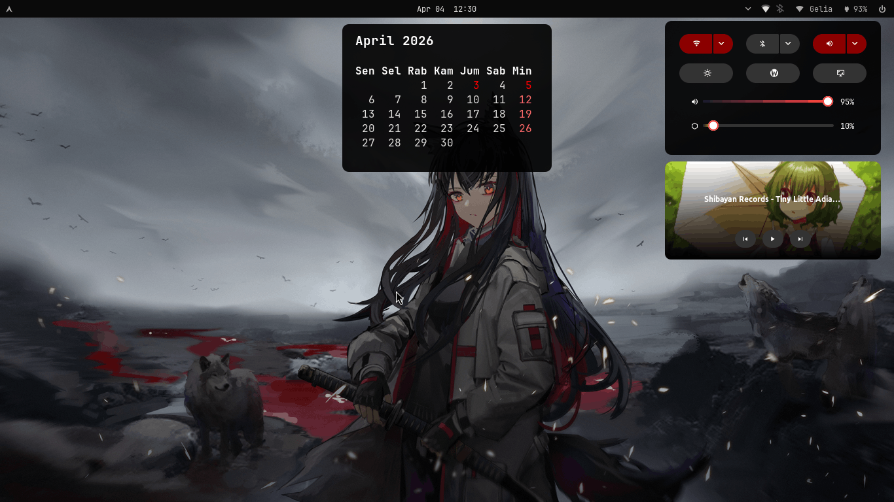
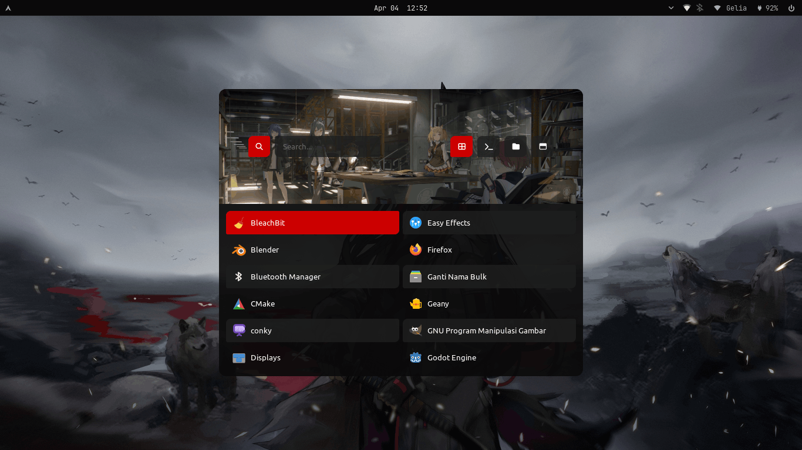

# my-wayfire-config
> Work in progress

Konfigurasi desktop pribadi berbasis Wayfire + Wayland untuk Arch Linux dan Arch-based lainnya.

---

## Features

- Lightweight Wayfire setup
- Custom action center (eww)
- Clean keybindings
- Low-end friendly

---

## Tampilan

> Action Center (eww)



> Launcher (rofi)



---

## Dependensi

| Package | Keterangan |
|---|---|
| wayfire | Wayland compositor |
| waybar | Status bar |
| kitty | Terminal emulator |
| rofi | App launcher |
| mako | Notification daemon |
| eww | Widget system |
| xdg-desktop-portal-wlr | Portal (screen share, file picker) |
| swaylock | Lock screen default |
| gtklock | Lock screen alternatif |

> Sebagian package tersedia di Chaotic-AUR. Jalankan `setup_repos.sh` terlebih dahulu.

---

## Instalasi

### 1. Clone repo

```bash
git clone https://github.com/adrianpriza-ai/my-wayfire-config.git ~/my-wayfire-config
cd ~/my-wayfire-config
```

### 2. Setup repo (opsional tapi direkomendasikan)

Jalankan script ini untuk menambahkan Chaotic-AUR, ArchLinuxCN, dan/atau yay:

```bash
chmod +x setup_repos.sh
./setup_repos.sh
```

Pilihan yang tersedia:
```
1) Chaotic-AUR + ArchLinuxCN
2) yay
3) Keduanya
```

### 3. Install config

```bash
chmod +x install.sh
./install.sh
```

Script ini akan:
- Backup config lama di `~/.config/` dengan suffix `-clone-YYYYMMDD-HHMMSS`
- Copy config baru ke `~/.config/`
- Install package yang dibutuhkan (opsional)

---

### Manual install (opsional)

Jika tidak ingin menggunakan script:

```bash
sudo pacman -S wayfire wf-shell wf-config waybar kitty rofi mako swaylock
```

---

## Struktur Config

```
config/
├── eww/          # Widget system (action center, media player, dll)
├── fastfetch/	  # Hardware overview
├── fish/		  # Shell
├── gtklock/      # GTK lock screen
├── kitty/        # Terminal
├── mako/         # Notifikasi
├── rofi/         # App launcher
├── swaylock/     # Lock screen
├── waybar/       # Status bar
├── wayfire/      # Wayfire config / assets
└── wayfire.ini   # Konfigurasi utama Wayfire
```

---

## Script

| Script | Fungsi |
|---|---|
| `setup_repos.sh` | Setup Chaotic-AUR, ArchLinuxCN, dan/atau yay |
| `install.sh` | Backup config lama, copy config baru, install package |

---

## Restore Config Lama

Jika ingin kembali ke config sebelumnya:

```bash
# Contoh restore kitty
mv ~/.config/kitty-clone-YYYYMMDD-HHMMSS ~/.config/kitty

# Contoh restore waybar
mv ~/.config/waybar-clone-YYYYMMDD-HHMMSS ~/.config/waybar
```

---

## ⌨️ Shortcuts

### 🖥️ Launch & Apps
| Shortcut | Aksi |
|--------|------|
| `Ctrl + Alt + T` | Buka terminal (kitty) |
| `Super + Space` | Launcher (rofi) |
| `Super + E` | File manager (thunar) |
| `Super + B` | Browser (firefox) |

### 📸 Screenshot
| Shortcut | Aksi |
|--------|------|
| `Print` | Screenshot full |
| `Super + Shift + S` | Screenshot area (grim + satty) |

### 🔊 Audio & 💡 Brightness
| Shortcut | Aksi |
|--------|------|
| `Volume Up / Down` | Atur volume |
| `Mute` | Toggle mute |
| `Brightness Up / Down` | Atur kecerahan |

### 🪟 Window Management
| Shortcut | Aksi |
|--------|------|
| `Super + Q` | Close window |
| `Super + F` | Fullscreen |
| `Super + M` | Maximize |
| `Super + H` | Minimize |
| `Super + T` | Always on top |

### 🧩 Window Tiling (Grid)
| Shortcut | Aksi |
|--------|------|
| `Super + ← / →` | Snap kiri / kanan |
| `Super + ↑ / ↓` | Snap atas / bawah |
| `Super + Shift + Arrow` | Snap ke sudut |

### 🔄 Workspace & Overview
| Shortcut | Aksi |
|--------|------|
| `Alt + Tab` | Next window |
| `Alt + Shift + Tab` | Previous window |
| `Super + Tab` | Expo |
| `Super + W` | Scale (overview) |

### ⚙️ System
| Shortcut | Aksi |
|--------|------|
| `Ctrl + Alt + Delete` | Power menu |
| `Super + A` | Action center (eww) |

---

## Overview

- Distro: Arch Linux (dan turunannya)
- Compositor: Wayfire (Wayland)
- Shell: Custom (waybar + eww)
- Launcher: rofi
- Target: Low-end hardware (1366x768)
- Screenshot: grim + satty
- Volume: pactl (PipeWire / PulseAudio)
- Brightness: brightnessctl
- Action center: eww

## Credits

- Rofi theme inspired by [adi1090x/rofi](https://github.com/adi1090x/rofi)

## Troubleshooting

- Jika rofi tidak muncul:
  Pastikan Wayland support aktif atau coba alternatif seperti wofi/fuzzel

## Notes

- This config is still a work in progress
- Some features may not work on all hardware
